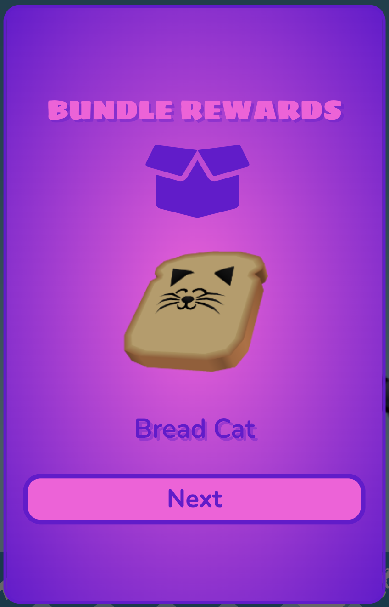
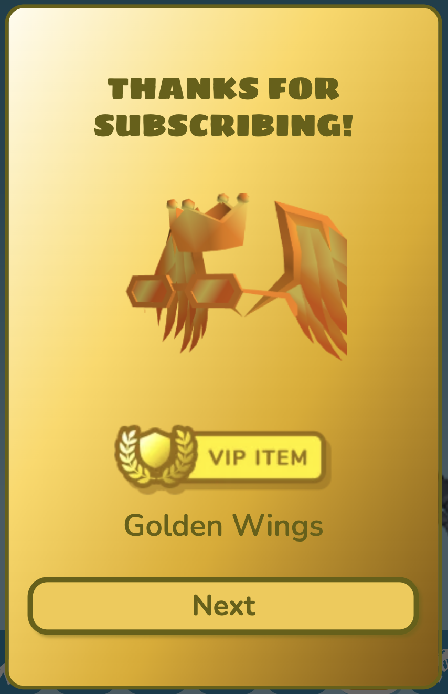

# The MegaMod

### Created by Infinite Smasher
> Welcome to The MegaMod! This collection of mods is designed to enhance your Shell Shockers experience. From fun features to useful additions that elevate the game's functionality, this culmination of all my mods (with new additions and features), is your one-stop solution!

> For any suggestions or feature requests, join the [Infinite's Shell Mods](https://discord.gg/Cxggadazy4) Discord Server!

## Installation
#### To install **The MegaMod** for Shell Shockers, follow these steps:

### Step 1: Install a Userscript Manager
You'll need a userscript manager to run The MegaMod on your browser. I recommend using one of the following:
- **[Tampermonkey](https://www.tampermonkey.net/)** (Recommended)
- **[Greasemonkey](https://www.greasespot.net/)**
- **[Violentmonkey](https://violentmonkey.github.io/)**

> [!NOTE]  
> Some userscript managers may require Developer Mode to be enabled to allow custom scripts. Follow these steps to enable Developer Mode:
> 1. Open your browser's Extensions page:
> - **Google Chrome**:
>   - Click the menu (three dots in the top-right corner), then select Extensions > Manage Extensions.
>   - Or manually type **chrome://extensions** into the address bar.
> - **Microsoft Edge**:
>   - Click the menu (three dots in the top-right corner), then select Extensions.
>   - Or manually type **edge://extensions** into the address bar.
> - **Brave**:
>   - Click the menu (three horizontal lines in the top-right corner), then select Extensions.
>   - Or manually type **brave://extensions** into the address bar.
> - **Opera GX**:
>   - Click the Extensions button (cube icon on the left sidebar or top-right corner).
>   - Or manually type **opera://extensions** into the address bar.
> 2. Find and click the "Developer Mode" toggle (usually in the top right corner of the page). 
> **Note**: On Opera GX, you may also have to close the window and open a new one for the changes to take effect

### Step 2: Disable All Other Mod Scripts
The MegaMod isn't optimized or recommended for use along with other mods. Having other mods enabled can break features of the MegaMod and cause unexpected bugs. If you notice any features of the MegaMod not working as expected, try disabling all other mods first before reporting issues.

### Step 3: Install The MegaMod Script
After installing the userscript manager, [click here](https://infinitesmasher.github.io/The-MegaMod/js/script.user.js) to install **The MegaMod**. Then, follow the prompts to add the script to your userscript manager.

### Step 4: Enable the MegaMod
Once the script is installed, head to [Shell Shockers](https://shellshock.io/) and start playing. The MegaMod will load automatically on game start.

### Step 5: Stay Updated
The script is set to auto-update and will prompt you to install the latest update of The MegaMod if your version is outdated.

## Changelog

  
Changelog

  

## The MegaMod
### General Settings (Click The Gear Tab)

General Settings

> - **MegaMod UI Sound Effects** - Enables sound effects related to the MegaMod
>   - **Specific Sounds**:
>     - **Tab Sounds** - Sound effects for mods tab and mod settings tab
>     - **Hover Sounds** - Sound effects for hovering on settings tab icon and mod settings icons
> - **Faster CSS Loading** - Makes CSS Load Faster
> - **In-Game Mod Toggle Alerts** - Enables small in-game alerts for mods with toggle keybinds

### MegaMod UI
Mods can be found on a brand new tab in the settings menu. Each mod can be enabled/disabled with the checkboxes and futher info/settings can be accessed by clicking the gear icon next to the mod's name in the list.

Mods (Image)
 
  
  

This new tab in the settings menu shows the description for a specific mod along with additional settings it. If selected directly from the mods tab, it shows additional settings for The MegaMod itself.

 

Mod Settings (Image)

  
  

There's a new link added to the footer on the home screen, which opens a changelog dedicated just for The MegaMod. There's also an image link to Infinite's Shell Mods Discord Server.

Footer Link + In-Game Changelog (Images)

  
  

## The Eggcellent Mods

Better UI

> > Enhances the inventory and profile UI with new themes, a skin randomizer, profile badges, and more.
> ### **Settings**:
> - **General UI Tweaks**: Various UI improvements.
> 

> 
More Info

> 
> >    - Latest FontAwesome Social Media Icons
> >    - Updated Social Media Footer Icon Styles & Tooltip Position
> >    - Egg-Shaped Settings Sliders
> >    - Egg-Shaped Settings Checkboxes
> >    - Added margins around chat (on Despawn Menu) so it isn't fixed to edge of screen
> >    - Added margins to media tabs and top right buttons (on Home Screen) so they aren't fixed to edge of screen
> >    - Various UI Bug Fixes:
> >       - Fixed Short Scrollmask Width
> >       - Fixed YT + Twitch Box Height
> >       - Adjusted Create Private Game Popup Alignments
> >       - Fixed Slightly Taller Challenge Box
> >       - Stretched Chick'n Winner Bar (on Despawn Menu) to fix text wrap (and for better looks ofc)
> >
> >   - Added Button (on Home Screen) and Popup to Show Current Public Map Pool
> >     

> >     
Public Map Popup (Image)

> >     
> >     
> >     

> > 
> >   - Added Button (on Home Screen) and Popup to Game History (Daily Lobbies)
> >     

> >     
Game History Popup (Image)

> >     
> >     
> >     

> >
> >   - Numbers are localized to add regional separators (make large numbers easier to read) and use the local place value system:
> >     - Egg Count
> >     - Item Prices
> >     - Profile Stats Values
> >     - Egg Reward Amounts
> >     - etc.
> >   - Corrupted Grenade given Premium Item theme to match the other Premium Items purchasable with Golden Eggs
> >   - Server Select dropdown is back on the Home Screen!
> >   - Restyled Join Code Input to work better with the new game code format (WORD-WORD-WORD)
> >     - Detects and fills in the code when pasting a full game link
> >     - Autofills observe toggle and watchPlayer info (Eggforcers Only)
> >     

> >     
New Code Input (Image)

> >     
> >     
> >     

> 

> 
> - **Chick'n Winner Upgrades**: Adds various upgrades to Chick'n Winner.
> 

> 
More Info

> 
> >   - Chick'n Winner now shows when you pull an item you already own.
> >   - Fixed Chick'n Winner egg icon not being on the same line as egg reward amount
> >     

> >     
Updated Chick'n Winner (Image)

> >     
> >     
> >     

> >   
> >   - The Chick'n Winner Popup can now only be closed after you get your reward  - no more accidental closures!
> 

> 
> - **Challenge Upgrades**: Adds various upgrades to Challenges.
> 

> 
More Info

> 
> >   - Added Icons to challenges to show if they're unique or already completed
> >   - Restyled Challenge "Claimed" Banner to match checkmark banner
> >     

> >     
Challenge Icons & Restyled "Claimed" Banners (Image)

> >      
> >     
> >     

> >   
> >   - Added missing clock icon next to challenge timer on home screen
> >   - Added claim sound effect when claiming challenges 
> >   - Added claim sound effect when auto-claiming challenges through notification popup
> >   - Added info popup for challenges which shows all challenges with info such as icon, reward amounts, tier, type, # of claims, etc
> >    

> >    
Challenge Info Popup (Image)

> >     
> >    
> >    

> 

> 
> - **Better Inventory**
> 

> 
More Info

> 
> > - __UI Improvements__:
> >   - Rounded item and weapon select buttons
> >   - Better **color matching** on existing item theme properties:
> >     - Price Labels
> >     - Spinning Egg (Item Image Loading)
> >     - Item Borders
> >   - New **gradient effect** (+ fade-in animation) for themed items when selected
> >   - Item Search Feature (This was added into the game on October 1st, 2023!)
> >   - EggK-47s and Whippers with sound effects now play a burst of their sound effect when clicked!
> >   - Fixed Bugs:
> >     - Equipped weapon skin wasn't highlighted after switching classes
> >     - Sound effect played when switching tabs in shop
> >     - Weapon skin buttons could be deselected
> >     - Photobooth wasn't updating pistol when switching main weapon class
> >     - Fixed wonky item banners for items showing in bundle popup
> > - __New Item Themes__:
> >   - ``Bundle`` - Items available through bundles only
> >   - ``Limited`` - Limited-time items (in "Limited Edition" shop section)
> >   - ``Twitch Drops`` - Items available through Twitch Drops
> >   - ``Merch`` - Hats that were previously obtained through buying Shell Shockers merchandise
> >   - ``Yolker`` - New Yolker Items
> >   - ``League`` - Clan/Tournament Hats and Stamps
> >   - ``Notif`` - Hats created for and rewarded through the (discontinued) Notification System
> >   - ``Egglite`` - Code-unlockable items that fit no other categories
> >   - ``Promo`` - Cross-Promotional items unlocked by playing other BWD games (ex: Skull Wand Pistol)
> >   - ``Event`` - Event rewards from events such as EGG ORG or Scavenger Hunt
> >   - ``Social`` - Social media rewards (Hats) from the homepage
> >   - ``Legacy`` - Legacy default weapon skins from 2018/2019
> >   - ``YT CC`` - BWD YouTube CC shop items
> >   - ``Twitch CC`` - BWD Twitch CC shop items
> >   

> >   
Item Themes (Image)

> >    
> >   
> >   

> > - Code Cracked popup is themed to match the item theme of the cracked item
> >   

> >   
Themed Code Cracked Popup (Image)

> >    
> >   
> >   

> > - Chick'n Winner popup is themed to match the item theme of the cracked item (after you reveal the item)
> >   

> >   
Themed Chick'n Winner Popup (Image)

> >    
> >   
> >   

> > 
> > - __Changed Item Sorting Order__:
> >   1. Bundle
> >   2. Premium (Money)
> >   3. Premium (Golden Eggs)
> >   4. VIP
> >   5. Merch
> >   6. Twitch Drops
> >   7. New Yolker
> >   8. League
> >   9. Notification
> >   10. Egglite
> >   11. Promo
> >   12. Event
> >   13. Social
> >   14. Default & Legacy Items
> >   15. Limited
> >   16. Content Creator (YouTube & Twitch)
> >   17. Shop Items 
> > - **Skin randomizer button** - randomizes all equipped items (including grenade and melee) for the currently selected weapon class
> > - **Item count information** in inventory, shop, and limited edition section:
> >   - __Inventory__: shows # of items owned / total # of items
> >     - __Limited Edition__: shows # of limited items owned / total # of limited items
> >   - __Shop__: shows # of items remaining to purchase / total # of shop items (including vaulted shop items)
> >     - __Limited Edition__: shows # of limited items remaining to purchase / total # of limited items
> > - Clickable **Item Icons** for most of the custom item themes!
> >   - Premium (matches your local currency) - switches to the shop tab of the shop
> >   - VIP - opens VIP popup
> >   - Bundle - switches to the shop tab of the shop
> >   - Merch - opens merch store
> >   - Twitch Drops - opens Twitch Drops page
> >   - New Yolker - opens New Yolker signup page
> >   - Notification - requests to turn on notifications
> >   - Promo - opens the particular promotion of the item
> >   - Social - opens the particular BWD social media page of the item
> >   - Limited - opens limited edition section and shows all owned limited items
> >   - Content Creator - links directly to the social media profile of the content creator
> > - **Item Vault** - lets you preview unowned vaulted items (only in the inventory). Photobooth is disabled while in the Item Vault and you can't use the items in-game.
> >   - Clicking an unowned social item opens the social media page and rewards the item.
> >   - Clicking an unowned VIP item opens the VIP subscription popup
> >   

> >   
Item Vault UI (Image)

> >   
> >   
> >   

> > - Server Select dropdown is back on the home screen!
> > - Themed Bundle and VIP Notification Popups
> >   

> >   
Themed Notification Popups (Image)

> >   
> >   
> >   
> >   

> 

> 
> - **Better Profile**
> 

> 
More Info

> 
> > - **Profile Pictures** have returned in the profile section! Accounts that don't have a profile picture get a default one displayed.
> >   

> >   
Updated Profile Section (Image)

> > 
> >   
> >   

> > 
> > 

> > 
Tier Badge Level Up Alert (Image)

> > 
> > 
> > 

> > 
> > - **Profile Badges** - Clickable & Automatically Computed/Displayed:
> >   - Core Badges (27):
> >     - General Badges (11):
> >       | Badge Name           | Description                                             |
> >       | -------------------- | ------------------------------------------------------- |
> >       | VIP Subscriber       | Have an active VIP subscription                         |
> >       | Wizard               | Be one of the developers (Wizards)                      |
> >       | BWD Mod              | Be one of the BWD Discord moderators                    |
> >       | Eggforcer            | Be one of the Shell moderators (Eggforcers)             |
> >       | Shell League Staff   | Be a staff member of the Shell League                   |
> >       | Shell Wiki Staff     | Be a staff member on the official Shell Shockers Wiki    |
> >       | OG Player            | Account Created in 2019 or Earlier                      |
> >       | Pandemic Player      | Account Created in 2020                                 |
> >       | Farm-Fresh Player    | Account less than a month old                           |
> >       | Eggcellent Hatchday! | Today is your account's birthday!                       |
> >       | MegaMod Playtester   | Helped playtest The MegaMod before its release - tysm!  |
> >     - Event Badges (9):
> >       | Badge Name           | Description                                                                |
> >       | -------------------- | -------------------------------------------------------------------------- |
> >       | Treasure Hunter      | Participated in the Scavenger Hunt 2022 event                              |
> >       | ATTN: EGG ORG.       | Participated in the first EGG ORG event (2020)                              |
> >       | Pablo > Diablo       | Participated in the "EGG ORG: Phase II" (EGG ORG 2021) event               |
> >       | Pablo's Saviour      | Participated in the "Timetwist" (EGG ORG 2022) event                       |
> >       | Monsters Win!        | Participated in the "EGG ORG & Eggventure" (EGG ORG 2023) event            |
> >       | N0 M0R3 R0B0TS       | Participated in the "Rise of the Robots" (EGG ORG 2024) event              |
> >       | Egg-Fu Master        | Played as an Egg-Fu Master during the \"Shadow War\" (EGG ORG 2025) event  |
> >       | Eggsassin            | Played as an Eggsassin during the \"Shadow War\" (EGG ORG 2025) event      |
> >       | Shadowborn Survivor  | Participated in the "Shadow War" (EGG ORG 2025) event                      |
> >     - Social Badges (7) - **BWD Content Creators Only**:
> >       > Matches the CC social media linked to your Shell Shockers account!
> >       - Facebook
> >       - Instagram
> >       - TikTok
> >       - Discord
> >       - YouTube
> >       - Twitter (X)
> >       - Twitch
> >     
> >   - Tier Badges (18 Unique, 88 Total):
> >     > The highest tier of a particular badge is displayed on your profile
> >  
> >     | Badge Name           | Description                                | Tier Requirements |
> >     | -------------------- | ------------------------------------------ |------------------ |
> >     | Eggstra Spender      | % of Premium Items Owned                   | <table><thead><tr><th>Tier</th><th>Requirement</th></tr></thead><tbody><tr><td>I</td><td>10%</td></tr><tr><td>II</td><td>20%</td></tr><tr><td>III</td><td>30%</td></tr><tr><td>IV</td><td>50%</td></tr><tr><td>V</td><td>80%+</td></tr></tbody></table>|
> >     | Challenge Eggcepted  | # of Unique Challenges Completed           | <table><thead><tr><th>Tier</th><th>Requirement</th></tr></thead><tbody><tr><td>I</td><td>10</td></tr><tr><td>II</td><td>25</td></tr><tr><td>III</td><td>50</td></tr><tr><td>IV</td><td>75</td></tr><tr><td>V</td><td>100+</td></tr></tbody></table>|
> >     | Overeggchiever       | # of Total Challenges Completed            | <table><thead><tr><th>Tier</th><th>Requirement</th></tr></thead><tbody><tr><td>I</td><td>50</td></tr><tr><td>II</td><td>100</td></tr><tr><td>III</td><td>250</td></tr><tr><td>IV</td><td>500</td></tr><tr><td>V</td><td>1,000+</td></tr></tbody></table>|
> >     | Eggspenditure        | Golden Eggs Spent                          | <table><thead><tr><th>Tier</th><th>Requirement</th></tr></thead><tbody><tr><td>I</td><td>500,000</td></tr><tr><td>II</td><td>1,000,000</td></tr><tr><td>III</td><td>2,500,000</td></tr><tr><td>IV</td><td>5,000,000</td></tr><tr><td>V</td><td>7,500,000+</td></tr></tbody></table>|
> >     | Shell Scrambler      | Lifetime Kills                             | <table><thead><tr><th>Tier</th><th>Requirement</th></tr></thead><tbody><tr><td>I</td><td>10,000</td></tr><tr><td>II</td><td>25,000</td></tr><tr><td>III</td><td>50,000</td></tr><tr><td>IV</td><td>100,000</td></tr><tr><td>V</td><td>200,000+</td></tr></tbody></table>|
> >     | Master of Arms       | Lifetime Kills With Every Weapon           | <table><thead><tr><th>Tier</th><th>Requirement</th></tr></thead><tbody><tr><td>I</td><td>250</td></tr><tr><td>II</td><td>500</td></tr><tr><td>III</td><td>750</td></tr><tr><td>IV</td><td>1,000</td></tr><tr><td>V</td><td>2,500+</td></tr></tbody></table>|
> >     | Eggsecutioner        | Lifetime Kills in Every Game Mode          | <table><thead><tr><th>Tier</th><th>Requirement</th></tr></thead><tbody><tr><td>I</td><td>500</td></tr><tr><td>II</td><td>1,000</td></tr><tr><td>III</td><td>5,000</td></tr><tr><td>IV</td><td>10,000</td></tr><tr><td>V</td><td>20,000+</td></tr></tbody></table>|
> >     | Splattered Yolk      | Lifetime Deaths                            | <table><thead><tr><th>Tier</th><th>Requirement</th></tr></thead><tbody><tr><td>I</td><td>10000</td></tr><tr><td>II</td><td>25000</td></tr><tr><td>III</td><td>50000</td></tr><tr><td>IV</td><td>100000</td></tr><tr><td>V</td><td>200000+</td></tr></tbody></table>|
> >     | Humpty's Fall        | # of Fall Deaths                           | <table><thead><tr><th>Tier</th><th>Requirement</th></tr></thead><tbody><tr><td>I</td><td>10</td></tr><tr><td>II</td><td>25</td></tr><tr><td>III</td><td>50</td></tr><tr><td>IV</td><td>100</td></tr><tr><td>V</td><td>250+</td></tr></tbody></table>|
> >     | Overkill             | Lifetime KDR                               | <table><thead><tr><th>Tier</th><th>Requirement</th></tr></thead><tbody><tr><td>I</td><td>0.75</td></tr><tr><td>II</td><td>1.00</td></tr><tr><td>III</td><td>2.00</td></tr><tr><td>IV</td><td>3.00</td></tr><tr><td>V</td><td>4.00+</td></tr></tbody></table>|
> >     | Eggsassin            | Lifetime KDR in Every Game Mode            | <table><thead><tr><th>Tier</th><th>Requirement</th></tr></thead><tbody><tr><td>I</td><td>0.75</td></tr><tr><td>II</td><td>1.00</td></tr><tr><td>III</td><td>2.00</td></tr><tr><td>IV</td><td>3.00</td></tr><tr><td>V</td><td>4.00+</td></tr></tbody></table>|
> >     | Royal Rooster        | Lifetime KoTC Round Wins                   | <table><thead><tr><th>Tier</th><th>Requirement</th></tr></thead><tbody><tr><td>I</td><td>100</td></tr><tr><td>II</td><td>250</td></tr><tr><td>III</td><td>500</td></tr><tr><td>IV</td><td>1,000</td></tr><tr><td>V</td><td>2,000+</td></tr></tbody></table>|
> >     | Coop King            | Lifetime KoTC Coop Captures                | <table><thead><tr><th>Tier</th><th>Requirement</th></tr></thead><tbody><tr><td>I</td><td>250</td></tr><tr><td>II</td><td>500</td></tr><tr><td>III</td><td>1,500</td></tr><tr><td>IV</td><td>2,500</td></tr><tr><td>V</td><td>5,000+</td></tr></tbody></table>|
> >     | Eggsclusive          | % Owned of Current Update's Limited Items  | <table><thead><tr><th>Tier</th><th>Requirement</th></tr></thead><tbody><tr><td>I</td><td>10%</td></tr><tr><td>II</td><td>20%</td></tr><tr><td>III</td><td>30%</td></tr><tr><td>IV</td><td>50%</td></tr><tr><td>V</td><td>80%+</td></tr></tbody></table>|
> >     | Yolky Drip           | # of Merch Items Owned                     | <table><thead><tr><th>Tier</th><th>Requirement</th></tr></thead><tbody><tr><td>I</td><td>1</td></tr><tr><td>II</td><td>2</td></tr><tr><td>III</td><td>3</td></tr></tbody></table>|
> >     | Twitch Drops         | % Owned of Twitch Drops Items              | <table><thead><tr><th>Tier</th><th>Requirement</th></tr></thead><tbody><tr><td>I</td><td>10%</td></tr><tr><td>II</td><td>25%</td></tr><tr><td>III</td><td>50%</td></tr><tr><td>IV</td><td>75%</td></tr><tr><td>V</td><td>100%</td></tr></tbody></table>|
> >     | Colleggter           | % Owned of New Yolker Items                | <table><thead><tr><th>Tier</th><th>Requirement</th></tr></thead><tbody><tr><td>I</td><td>10%</td></tr><tr><td>II</td><td>25%</td></tr><tr><td>III</td><td>50%</td></tr><tr><td>IV</td><td>75%</td></tr><tr><td>V</td><td>100%</td></tr></tbody></table>|
> >     | Pro Egg Gamer        | # of League Items Owned                    | <table><thead><tr><th>Tier</th><th>Requirement</th></tr></thead><tbody><tr><td>I</td><td>1</td></tr><tr><td>II</td><td>2</td></tr><tr><td>III</td><td>3</td></tr><tr><td>IV</td><td>7</td></tr><tr><td>V</td><td>9+</td></tr></tbody></table>|
> >     | Egglitist            | % Owned of Egglite Items                   | <table><thead><tr><th>Tier</th><th>Requirement</th></tr></thead><tbody><tr><td>I</td><td>10%</td></tr><tr><td>II</td><td>20%</td></tr><tr><td>III</td><td>30%</td></tr><tr><td>IV</td><td>50%</td></tr><tr><td>V</td><td>90%+</td></tr></tbody></table>|
> >     | Poached Promoter     | % Owned of Promo Items                     | <table><thead><tr><th>Tier</th><th>Requirement</th></tr></thead><tbody><tr><td>I</td><td>10%</td></tr><tr><td>II</td><td>25%</td></tr><tr><td>III</td><td>50%</td></tr><tr><td>IV</td><td>75%</td></tr><tr><td>V</td><td>100%</td></tr></tbody></table>|
> > 
> >   

> >   
Profile Badge Popup (Image)

> >   
> >   
> >   

>   

> 
> - **Force Roundness**: Makes the UI more comfy by rounding the corners on buttons, popups, and more! No more nasty sharp edges!
> 
> - **MOAR Colored UI**: Adds a splash of color to buttons and icons such as the News Tabs and social media footer icons.
> 
> - **Yellow Hit Markers**: Makes the hit markers yolk yellow instead of red because egg yolk is yellow and eggs don't bleed blood :)
>
> - **Weapon Iconss**: Adds weapon icons on the Player List and Kill Feed
> 

> 
More Info

> 
> >   - Shows Primary Weapon Icons on Player List
> >     

> >     
Primary Weapon Icons on Player List (Image)

> >      
> >     
> >     

> >   
> >   - Shows Primary Weapon Icons (or Pistol) next to names on the Kill Feed
> >     

> >     
Primary Weapon Icons (or Pistol) on Kill Feed (Image)

> >     
> >     
> >     

> 

> 
> - **Kill Distance**: Shows Kill Distance (in m) next to each kill on the Kill Feed
>   > (This idea was first released in a mod by Agent Adam)
> 

>   
Kill Distance on Kill Feed (Image)

>   
>   
> 

Better Chat

 
> > Various Upgrades & Additions to In-Game Chat.
> ### **Settings**:
> - **Chat Icons**: Added Icons next to to MOD, SERVER, ANNOUNCEMENT, and Chat Event messages.
>   

>   
Chat Icons (Image)

>   
>   
>   

> 
> - **Longer Chat**: Increases the visible chat message limit from 5 to 7 messages
> 
> - **Infinite Chat History**: Removes the chat history limit, allowing you to scroll through all of the messages sent after you joined a game.
> 
> - **Chat Translator**: Translates chat messages into the language you're using for Shell Shockers with a toggle to switch between translated and original.
>   

>   
Chat Translator UI (Image)

>   
>   
>   

>
> - **Auto-Translate Chat**: Automatically translates incoming chat messages by default.
>
> - **Detect Game Codes**: Lets you click on game codes in chat messages to join them.
>   

>   
Detect Game Codes UI (Image)

>   
>   
>   
>   

> 
> - **Chat Events**: Adds messages in chat for different player events (below):
>     > (each Chat Event has its own dedicated setting to enable/disable it)
>   - **Chat Events Added to Chat**:
>     - Join Game - _PLAYER_ joined.
>     - Leave Game - _PLAYER_ left.
>     - Switch Team - _PLAYER_ switched to BLUE/RED team.
>     - Pick Up Spatula - _PLAYER_ picked up the spatula.
>     - Drop Spatula - _PLAYER_ dropped the spatula.
>     

>     
Chat Events (Image)

>   
>     
>     

VIP Color Slider

> > Adds sliders for hue, saturation, and brightness to customize your egg color in the inventory - slider also locks for non VIPs.
> > Also adds a color randomizer button.  
> ### **Settings**:
> - **Unlock (for non-VIPs)**: Unlocks the color slider for people without VIP.
> - **Auto-Save Custom Color**: Automatically saves and applies custom colors.
> - **Color Randomizer Button**: Adds a button to randomize your egg color (Color Slider included).
> 
> 

> 
Color Slider (Images)

> 
> 
> 
> 

Legacy Mode

> > Brings back legacy default weapon skins and sound effects from 2018/2019.
> ### **Settings**:
> - **Legacy Default Skins**: Enable old default weapon skin models.
>   

>   
Legacy Weapon Skins (Image)

> 
>   
>   

> - **Legacy Sound Effects**: Enable old in-game weapon sound effects. Legacy sounds also play in the inventory when clicking on legacy weapons!
> - **Gun-Specific Sounds**: Enable/disable legacy sounds for specific guns.
>   - Fire Sound
>   - Default-Only Fire Sound (Only the Legacy (Default) skin has the fire sound effect)
>   - Reload Sound(s)
> - **Grenade Sounds**: Enable/disable legacy sounds for grenades.
>   - Grenade Throw
>   - Grenade Beep
>   - Grenade Explosion
>   - Default-Only Explosion
> - **Other Sounds**: Enable/disable additional legacy sound effects.
>   - Ammo/Grenade Pickup
>   - Weapon Swap

Hide HUD

> > Hide or show the HUD (including player names, outlines, and pickups) while playing or in spectate mode for cinematic shots and clean recordings.  
> ### **Settings**:
> - **Hide/Show In-Game UI**: Keybind to Toggle HUD visibility.
> - Hide Crosshair
> - Hide Game Messages
> - Hide Grenade Power
> - Hide Healthbar
> - Hide Game Chat
> - Hide Gamemode UI
> - Hide Ammo Count
> - Hide Player List
> - Hide Readouts (Ping, FPS, etc)
> - Hide Egg Count
> - Hide Kill/Death Log
> - Hide Kill/Death Text
> - Hide Max Killstreak Indicator
> - Hide Spectate Info
> - Hide Grenade/Ammo Pickups
> - Hide Player Nametags
> - Hide Player Outlines
> 
>   

>   
HUD, Nametags, Player Outlines, & Pickups Hidden (Image)

> 
>   
>   

Killstreak Stats

> > Adds a stopwatch that starts when you spawn and a popup to display kill streak stats (COMING SOON). Also useful for timed challenges.  
> <!--**Settings**:-->
> <!--**Hide/Show Info Popup**: Toggle the display of kill streak stats.-->
>
>   

>   
Killstreak Stopwatch (Image)

> 
>   
>   

Match Grenade Pickups

 
> > Sets the grenade pickups to match your equipped grenade skin, also works in first-person spectate mode.
> 
>   

>   
Matching Grenade Pickups In-Game (Image)

> 
>   
>   

Change FPS

> > Allows you to adjust your FPS.  
> ### **Settings**:
> - **FPS Slider**: Adjust the FPS (1-999).

Spectate Tweaks

 
> > Tweaks for spectate mode. Also shows more keybinds on the "Spectating Player" box.
> ### **Settings**:
> - **Show Healthbar**: Display a player's healthbar while spectating them in first-person-spectate mode.
> - **Hide Main Crosshair**: Hide the main crosshair in first-person-spectate mode.
> - **Hide Crosshair Dot**: Hide the crosshair dot in first-person-spectate mode.
> - **Spectate Speed Slider**: Sets the % of the spectate speed (1% to 200%).
> - **Freeze Frame**: Sets the keybind toggle for freezing the players.

Photobooth Egg Spin

> > Spin your egg 360° in the photobooth and export the spin as a GIF.  
> ### **Settings (In Photobooth)**:
> - **Spin Speed**: Choose the speed of the spin.
>   - Slow
>   - Normal
>   - Fast
> - **Spinning GIF FPS**: Choose the FPS of the spinning GIF.
>   - Low (15 FPS)
>   - Medium (30 FPS)
>   - High (60 FPS)
> - **Spin Egg**: Rotate your egg.
> - **Save Spinning GIF**: Export the spinning egg as a GIF (Coming Soon!).

Custom Theme

> > Select and manage themes that change the UI's appearance, including menu backgrounds, button colors, crosshair, scope, and more.  
> ### **Settings**:
> - **Select Theme**: Choose a theme.
> - **Preload Themes**: Load themes faster by downloading them on startup.
> - **Available Themes**:
>
>   | Theme Name                 | Creator(s)                 | Description                                                                                                                    | Image                                                 |
>   | -------------------------- | -------------------------- | ------------------------------------------------------------------------------------------------------------------------------ | ----------------------------------------------------- |
>   | Boolet x DeltaStorm        | Boolet, Infinite Smasher    | Updated & improved version of [Boolet](https://youtube.com/@Boolet)'s theme. Used to be available on the Chrome WebStore.      |            |
>   | graysocean (Main)          | Infinite Smasher            | Updated & improved version of [graysocean](https://twitch.tv/graysocean)'s theme. Used to be available on the Chrome WebStore. |    |
>   | graysocean (Fashion Show)  | Infinite Smasher            | Fashion show-specific version of the graysocean (Main) theme.                                                                   | Same as Graysocean (Main)                             |
>   | Gus                        | Gus, Infinite Smasher       | Gus's theme.                                                                                                                   |                  |
>   | King Hayden                | Jayvan, Infinite Smasher    | Updated & improved version of [King Hayden](https://twitch.tv/king_hayden_)'s theme.                                           |       |
>   | Infinite Smasher            | Infinite Smasher            | Infinite Smasher's theme.                                                                                                       |  |
>   | menoXD                     | Jayvan, Infinite Smasher    | Updated & improved version of [menoXD](https://twitch.tv/menoxd)'s theme.                                                      |              |
>   | Novosuper                  | Jayvan, Infinite Smasher    | Updated & improved version of [Novosuper](https://twitch.tv/novosuper)'s theme.                                                |           |
  

Custom Skybox

> > Choose from over 60+ different skyboxes (or use a solid color) for all maps.  
> ### **Settings**:
> - **Skybox Category**: Select a category of skyboxes.
> - **Randomize Skybox**: Randomizes the skybox each time you enter a lobby.
> - **Select Skybox**: Choose a specific skybox from the selected category.
> - **Skybox Color (Color Picker)**: Set the skybox color when "Solid Colors" is selected as the Skybox Category.
> - **Skybox Categories**:
> 
>   | Category Name                                                                                                       | # of Skyboxes       |
>   | ------------------------------------------------------------------------------------------------------------------- | ------------------- |
>   | Official (In-Game Skyboxes)                                                                                          | 4                   |
>   | Solid Colors (RGB Color Sliders)                                                                                    | 256^3 = 16,777,216  |
>   | Landscapes                                                                                                          | 4                   |
>   | [AllSky](https://assetstore.unity.com/packages/2d/textures-materials/sky/allsky-free-10-sky-skybox-set-146014)      | 10                  |
>   | [Cartoon Clouds](https://assetstore.unity.com/packages/2d/textures-materials/sky/farland-skies-cloudy-crown-60004)  | 5                   |
>   | [Color Skies](https://assetstore.unity.com/packages/2d/textures-materials/sky/colorskies-91541)                     | 8                   |
>   | [Space](https://assetstore.unity.com/packages/2d/textures-materials/sky/spaceskies-free-80503)                      | 23                  |
>   | [Nebula](https://assetstore.unity.com/packages/2d/textures-materials/sky/skybox-volume-2-nebula-3392)               | 7                   |
>   | Other                                                                                                               | 5                   |
> 
>   Misc Skybox Sources: [Babylon.js](https://doc.babylonjs.com/toolsAndResources/assetLibraries/availableTextures#cubetextures), [elyvisions (OpenGameArt)](https://opengameart.org/content/elyvisions-skyboxes)
> 
> 

> 
What Skyboxes Look Like In-Game (Image)

> 
> 
> 

Custom Fog

> > CURRENTLY BROKEN as fog doesn't work in regular (unmodded) Shell either!
> > Enhance your game's atmosphere with customizable fog! Adjust the density and color to create anything from an eerie mist to a crystal-clear view across all maps.
> ### **Settings**:
> - **Fog Density (%)**: Set the density of the fog.
> - **Fog Color (Color Picker)**: Set the color of the fog.
> - **Randomize Fog**: Randomizes the fog density and color each time you enter a lobby.
> - **Reset to Map Defaults**: Resets fog density & color to the default for the map you're playing on.
> 
> 

> 
What Fog Looks Like In-Game (Image)

> 
> 
> 

Better Eggforce (Eggforcer-Only)

 
> > Adds some useful improvements and new features to make Eggforcing better! Now go swing that ban hammer!
> ### **Settings**:
> - **Improved Ban Popup**: Adds ability to copy a player's UniqueID, preset ban reasons, and automatic chat message sending functionality (with presets or custom message text box) to the ban player popup.
>   

>   
Improved Ban Player Popup (Image)

>   
>   
>   

> 
> - **Observer Toggle**: Adds a toggle on the join game popup to toggle on/off observer mode and enter a player UniqueID.
>   

>   
Observer Toggle (Image)

>   
>   
>   

> 
> - **Ban History**: Adds a button on homescreen and new popup to show the past bans you've handed out.
>   

>   
Ban History Popup (Image)

>   
>   
>   

> 
> - **Spectate-Only ESP**: Enables ESP that only works in spectate mode.
> - **Toggle ESP**: Sets the keybind to toggle on/offf Spectate-Only ESP.
> - **Auto Ban**: Auto-bans users with names/uniqueIDs that match the ones in the list.
> - **Name / UniqueID List**: Allows you to enter names/uniqueIDs to auto-ban.
> - **Disable Chat Filter**: Disables the Chat Filter and makes inappropriate chat messages red, highlighting the innapropriate parts.
>   

>   
Disabled Chat Filter (Image)

>   
>   
>   

